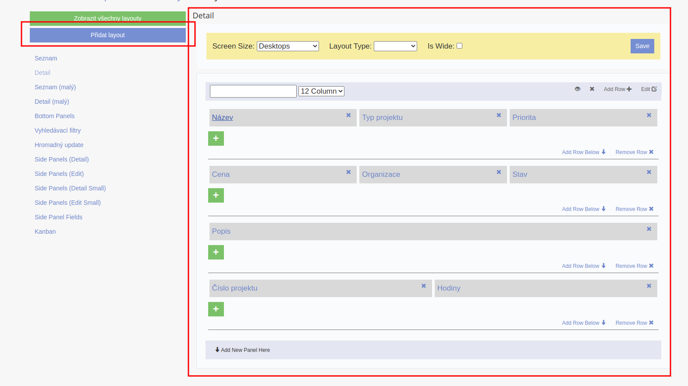
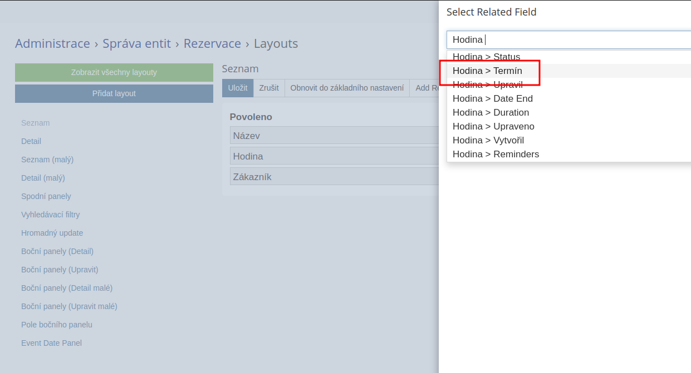
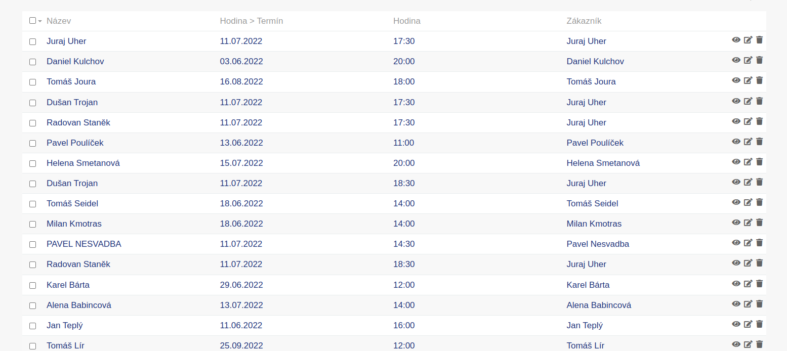
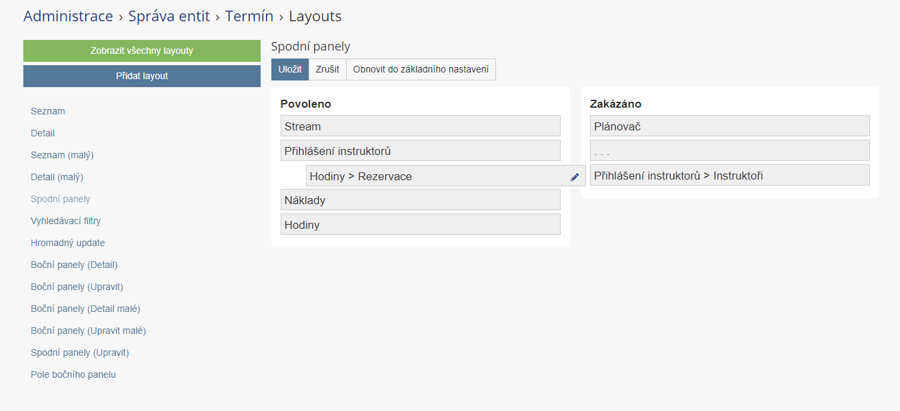
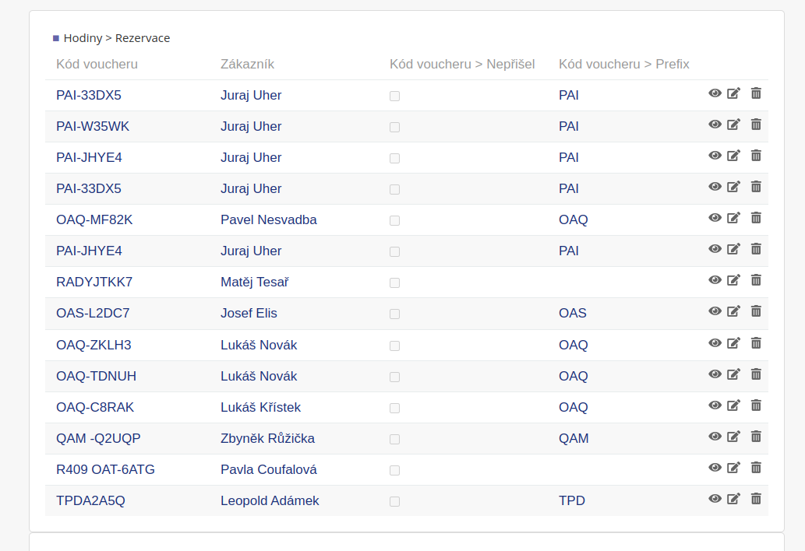

# VIA CRM Module

VIA CRM module for EspoCRM - základní modul pro vývoj.

## Installation

### Build from source

1. Clone the repository
2. Run `npm install`
3. Run `npm run build:zip`

## Development

```bash
npm run build  # Build the module
npm run watch  # Watch for changes
npm run deploy # Deploy to EspoCRM (requires .env config)
```

## Features

- Základní struktura modulu
- Test controller endpoint
- Build systém integrace


# Module - Autocrm
> The base module for all AutoCRM modules.

## Table of Contents

* [Requirements](#requirements)
* [Installation](#installation)
* [Features](#features)
    * [Better Layout Manager](#better-layout-manager)
    * [View Extensions](#view-extensions)
    * [Related Fields](#related-fields)
    * [Related Panels](#related-panels)
    * [Editable Fields in List Views](#editable-fields-in-list-views)
    * [Exchange Rates Sync With CNB](#exchange-rates-sync-with-cnb)
* [Requires](#requires)
* [Installation](#installation)
    * [Pre-build extension release](#pre-build-extension-release)
    * [Build from source](#build-from-source)

## Requirements
* [EspoCRM](https://www.espocrm.com/) (>= 7.5.0)
* [PHP](https://www.php.net/) (>= 8.2.0)

## Installation

### Pre-build extension release

1. Download the latest release from the [Releases](https://gitlab.apertia.cz/autocrm/modules/autocrm/-/releases) page.
2. Go to **Administration** -> **Extensions** and upload the downloaded archive.

### Build from source
*(requires Node, NPM and potentially Composer to be installed)*

1. Clone the repository.
2. Run `npm install`.
3. Run `npm run build`. This will create a `dist` folder with the final extension package.

### Deploying

Optionally you can create a `.env` file based on the `.env.template` file. The `.env` file will be used to deploy the
extension to an existing EspoCRM installation.

**Linux example**

```shell
mv .env.template .env
vim .env # set your environment variables
npm run deploy
```

## Development
This extension was created via the [Extension Template](https://gitlab.apertia.cz/autocrm/extension-template),
all the necessary information about the development process can be found there.

## Features

### Better Layout Manager

Feature-rich layout manager that allows to create different types of detail layouts inspired
by [Ebla](https://www.eblasoft.com.tr/). The manager also allows you to create custom layouts that can be set, for
example, as custom layouts for the bottom panels.

#### Example



---

### View Extensions

View extensions make it possible to change any view the same way as inheritance does.

**NOTE:** EspoCRM already provides many different ways to customize certain views. For example,
use [View Setup Handlers](https://docs.espocrm.com/development/frontend/view-setup-handlers/) whenever
possible. View extensions should only be used as a last resort.

#### Steps

1. Define the view extension mapping in `app.client.viewExtensions` metadata.
2. Create the view extension file and extend the view using the `extend` function.

```js
extend(extensionName, callback)
extend(extensionName, dependencies, callback)
```

#### Example

`custom/Espo/Custom/Resources/metadata/app/client.json`

```json
{
  ...
  "viewExtensions": {
    "views/detail": [
      "__APPEND__",
      "custom:extensions/view/detail"
    ],
    ...
  }
}
```

`client/custom/src/extensions/view/detail.js`

```js
extend('custom:extensions/view/detail', ['lib!new-dependency'], function (Dep, NewDependency) {
    return Dep.extend({
        ...
    });
});
```

---

### Layout extensions

Standard unifier, that is for example used to unify metadata, can be used to unify layouts.

#### Example

`custom/Espo/Custom/Resources/layouts/Settings/settings.json`

```json
[
  "__APPEND__",
  {
    "label": "My Settings",
    "rows": [
      [
        {
          "name": "myField",
          "type": "text",
          "label": "My Field"
        }, false
      ]
    ],
    "index": 1
  }
]
```

---

### Related Fields

Related fields are used to display related records fields in the **list view**.

#### Steps

1. Go to **Administration** -> **Layout Manager** and select the desired entity.
2. Select **list** view and add a new **related field**.
3. Start typing the name of the related entity.
4. Select the desired related field.

#### Example





---

### Related Panels

Using related panels it is possible to display joined related records in the bottom panels' section of **detail view**.

#### Steps

1. Go to **Administration** -> **Layout Manager** and select the desired entity.
2. Select **Bottom panels** section and move the desired related panel from the disabled section to desired position in
   the enabled section.
3. Optionally, change the layout of the related panel.

#### Example





---

### Editable Fields in List Views

Columns in list views can be made editable. This makes it possible to edit the values in relationship panels without
having to open the record. This feature **works** with related fields and panels.

#### Steps

1. Go to **Administration** -> **Layout Manager** and select the desired entity's list layout.
2. Click on the arrow next to the desired field.
3. Check the **Editable** checkbox.

#### Example


---


---

### Exchange Rates Sync With CNB

#### Steps

1. Go to **Administration** -> **Scheduled Jobs** and create a new job.
2. Select *Exchange rates sync with CNB* job.

#### Example

